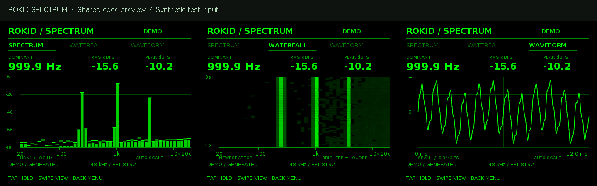
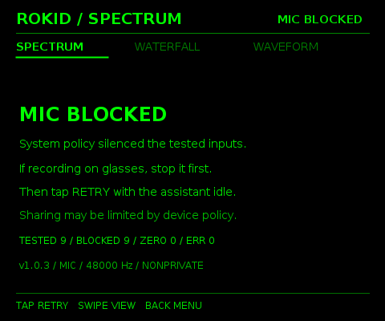
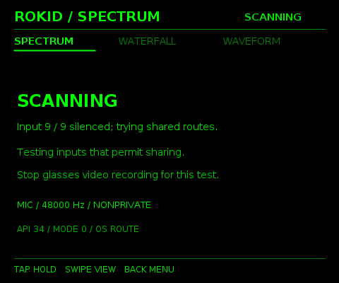
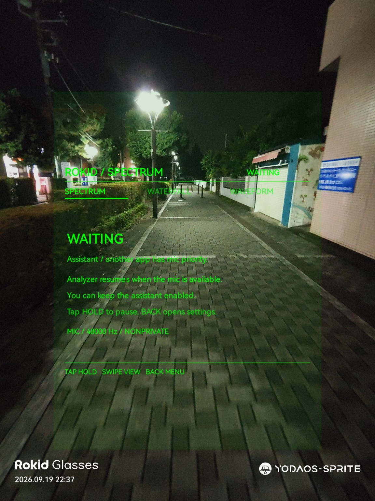

> **非公式・非提携**：本プロジェクトは個人による非公式の開発です。Rokid社およびその関連会社とは提携しておらず、承認・支援・スポンサー提供を受けていません。
> **Unofficial and unaffiliated**: This is an independent, unofficial project. It is not affiliated with, endorsed, supported, or sponsored by Rokid or its affiliates.

# Rokid Spectrum HUD — v1.0.3

**プレリリース / Pre-release** · Android 8.0+ (API 26+) · Java · MIT

Rokid Glasses向けに開発している、マイク入力のオーディオスペクトルアナライザです。黒背景に緑単色のHUDを表示します。
An experimental microphone audio spectrum analyzer for Rokid Glasses, with a green-on-black HUD.

[v1.0.3のAPK・ソース / APK and source](https://github.com/Xenoah/rokid-spectrum-hud/releases/tag/v1.0.3) · [全プレリリース / All prereleases](https://github.com/Xenoah/rokid-spectrum-hud/releases) · [日本語の詳細](README-ja.md)

## 日本語

### この版の変更 — 無期限WAITINGの解消と入力診断

- 無期限のWAITINGを有限回の入力検査へ変更。MIC／VOICEの16 kHz候補など、対応時は最大9プロファイルを試す。
- 開始時のポリシー無音化は約0.8秒、LIVE後の割り込みは約4秒の猶予後に次の候補へ進む。
- Android 11以降で非排他設定を確認してから開始し、要求が反映されない入力は使わない。入力デバイスの固定選択を撤廃。
- 全候補の検査後はマイクを解放し、MIC BLOCKED／NO SIGNAL／MIC ERRORと検査件数を表示。
- WAITINGや入力エラー画面のタップをRETRYに変更。アシスタント表示時のマイク解放・復帰とHOLD維持は継続。

**確認状況・制限:** 1.0.3の実機でのマイク取得とアシスタント併用は未検証です。全ての非排他入力を端末が拒否する場合、APKだけで同時取得を強制することはできません。初回の確認はグラスの録画・音声付き画面共有を止め、INPUT: AUTOで行ってください。

### 機能と使い方

- SPECTRUM、WATERFALL、WAVEFORMの3画面。最大成分周波数、RMS／ピークdBFS、ピーク保持を表示。
- マイク入力を端末内で解析します。音声の保存・送信機能はなく、INTERNET／CAMERA権限も使いません。
- DEMOは合成信号です。**dBFSは校正済みのdB SPL／dBAではありません。**
- HUDは480 × 400を中央配置。Rokid SDKやGoogle Playサービスへの依存はありません。機種・ファームウェアの差は未検証です。

下のAssetsから`RokidSpectrum-1.0.3.apk`を入手し、APKを導入できる端末にインストールしてください。初回はマイク権限を許可します。

```sh
adb install -r -g RokidSpectrum-1.0.3.apk
adb shell am start -n dev.xenoah.rokidspectrum/dev.xenoah.spectrum.MainActivity
```

同じ署名で新しいversionCodeへ更新できます。公開APKは元の開発用署名を保持しています。ローカルで新たに作った鍵では配布APKを上書きできません。

| 操作 | 動作 |
| --- | --- |
| タップ／Enter | LIVE/DEMOはHOLD・再開。WAITING／入力エラーはRETRY |
| スワイプ／左右キー | 3画面の切り替え |
| Back | メニューを開く／戻る |
| メニューでスワイプ・タップ | 項目選択・実行 |
| 長押し | ピーク・履歴を消去 |
| INPUT: DEMO | マイクなしで描画確認 |

### 検証とビルド

保存済みの検証結果は数値・状態処理29件、AudioEngine 32件、Activity 14件、描画17状態／文字境界263件です。
Android APIの代替実装とJava2Dによる検証であり、実機での測定保証ではありません。APKの構造・署名・バージョンも確認しています。詳細は[verification/](verification/)。

JDK 17、Python 3、Android SDKを用意し、以下のSDK直接ビルドを利用できます。Gradle構成（AGP 8.9.2、Gradle 8.11.1、compileSdk 35）も付属しますが、配布APKは直接ビルドで生成しました。

```sh
export ANDROID_JAR=/path/to/android-sdk/platforms/android-35/android.jar
export ANDROID_BUILD_TOOLS=/path/to/android-sdk/build-tools/35.0.0
python3 tools/build_apk.py
python3 tools/test_core.py
python3 tools/test_audio_lifecycle.py
python3 tools/test_activity_lifecycle.py
```

## English

### Changes in this version — Bounded input probing and WAITING diagnostics

- Replaces indefinite WAITING with a finite scan of up to nine supported profiles, including explicit 16 kHz MIC/VOICE probes.
- Advances after about 0.8 seconds of initial policy silencing, or a roughly 4-second grace period after LIVE capture.
- Verifies non-private capture before recording on Android 11+, rejects ignored requests and leaves device routing to Android.
- Releases all recorders after exhaustion and reports MIC BLOCKED, NO SIGNAL or MIC ERROR with diagnostic counts.
- Makes taps on WAITING/input errors retry capture while preserving assistant focus handling and user HOLD.

**Status and limitations:** Physical-device microphone capture and assistant coexistence remain unverified in 1.0.3. The APK cannot force shared capture if the device blocks every non-private input. For the first device check, stop glasses recording/audio screen sharing and use INPUT: AUTO.

### Features and usage

- SPECTRUM, WATERFALL and WAVEFORM views, with dominant frequency, RMS/peak dBFS and peak hold.
- Audio is processed locally. The app does not save or transmit audio and requests neither INTERNET nor CAMERA permission.
- DEMO uses generated signals. **dBFS is not calibrated dB SPL or dBA.**
- The 480 × 400 HUD is centered on the display. No Rokid SDK or Google Play services are required. Device and firmware variations remain unverified.

Download `RokidSpectrum-1.0.3.apk` from this version's release Assets, install it on a device that accepts sideloaded APKs and grant microphone permission. The ADB commands above install and launch it. Updates to a higher versionCode use the same original development signing certificate. A locally generated key cannot update the distributed APK.

| Control | Action |
| --- | --- |
| Tap / Enter | HOLD/resume in LIVE/DEMO; RETRY on WAITING/input errors |
| Swipe / Left / Right | Switch among the three views |
| Back | Open / close the menu |
| Swipe and tap in the menu | Select and apply an item |
| Long press | Clear peaks and history |
| INPUT: DEMO | Check the display without a microphone |

### Verification and building

Archived results cover 29 numerical/state tests, 32 AudioEngine tests, 14 Activity tests and 17 render states with 263 text-bound checks. These use Android framework doubles and Java2D, not physical-device measurement. APK structure, signing and version metadata have also been checked. See [verification/](verification/).

The commands above perform an SDK-direct build with JDK 17, Python 3 and Android SDK tools. The included Gradle project targets AGP 8.9.2 / Gradle 8.11.1 / compileSdk 35; that build route was not used for the distributed APK. Minimum SDK is 26 and target SDK is 32. Signing keys are excluded. `SPECTRUM_KEYSTORE` and `SPECTRUM_STOREPASS` can select a local key; the build creates a new development key if none exists.

### 画面 / Screenshots

以下はv1.0.3の共有Java描画コードによる**合成入力のDEMOプレビュー**です。実機やエミュレータのスクリーンショット、実音測定の証拠ではありません。
These are **synthetic DEMO previews** rendered with this version's shared Java renderer, not device/emulator screenshots or evidence of live capture.



入力状態の描画例 / Input-state rendering preview:





**実機の不具合記録 / Actual device issue report — v1.0.2, WAITING.**
この写真はv1.0.2の報告です。現在の版の成功例ではありません。
This photo documents the issue in v1.0.2; it does not demonstrate successful microphone analysis in v1.0.3.



[実機写真一覧 / Device screenshots](docs/screenshots/README.md)


## 公開履歴 / Release history

アプリのソースと署名済みAPKは各版の保存データに基づきます。公開にあたり日英ドキュメント、写真、公開用ワークフローを追加しています。全版プレリリースです。
Application source and signed APKs are preserved from each archived version. Bilingual documentation, photos and a publication workflow are added for the repository. Every version is a prerelease.

| Version | 主な変更 / Main change | Status |
| --- | --- | --- |
| [v1.0.0](https://github.com/Xenoah/rokid-spectrum-hud/releases/tag/v1.0.0) | 初版：3つの解析表示 / Initial spectrum HUD | Pre-release |
| [v1.0.1](https://github.com/Xenoah/rokid-spectrum-hud/releases/tag/v1.0.1) | MIC BUSY対策 / MIC BUSY recovery attempt | Pre-release |
| [v1.0.2](https://github.com/Xenoah/rokid-spectrum-hud/releases/tag/v1.0.2) | アシスタント併用への変更 / Non-private capture for assistant coexistence | Pre-release |
| [v1.0.3](https://github.com/Xenoah/rokid-spectrum-hud/releases/tag/v1.0.3) | 無期限WAITINGの解消と入力診断 / Bounded input probing and WAITING diagnostics | Pre-release |

## 公開ファイル / Release assets

各プレリリースには署名済みAPK、そのコミットのソースZIP、画像、SHA256SUMS.txtを添付します。ソースZIPは公開コミットから生成し、APKを含みません。元のアプリコードを変更せず、公開用の説明を追加しています。
Each prerelease includes the original signed APK, a source ZIP from its published commit, images and SHA256SUMS.txt. Source ZIPs exclude the APK and include the publication documentation alongside the unchanged application code.

`.release/`はその版の公開用APKとメタデータです。mainへの各版のpush後、[GitHub Actions](.github/workflows/prerelease.yml)がチェックサムを確認し、画像とソースを添付してプレリリースを公開します。署名秘密鍵はリポジトリ・配布物に含めません。
`.release/` contains that version's APK and metadata. After each version is pushed to main, the workflow verifies checksums and publishes its prerelease. No signing private key is included in the repository or releases.

## License / 参考仕様

[MIT License](LICENSE). Rokid and product names belong to their respective owners; use of those names does not imply affiliation.

- [Android audio input sharing](https://developer.android.com/media/platform/sharing-audio-input)
- [Android AudioRecord](https://developer.android.com/reference/android/media/AudioRecord)
- [AudioRecord.Builder.setPrivacySensitive](https://developer.android.com/reference/android/media/AudioRecord.Builder#setPrivacySensitive(boolean))
