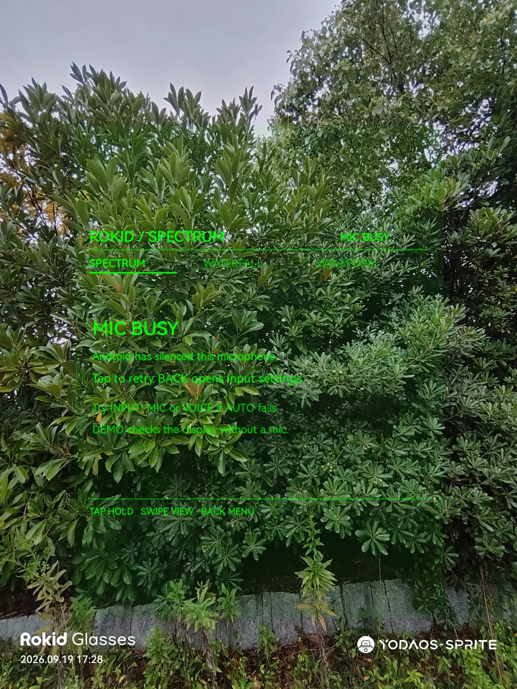
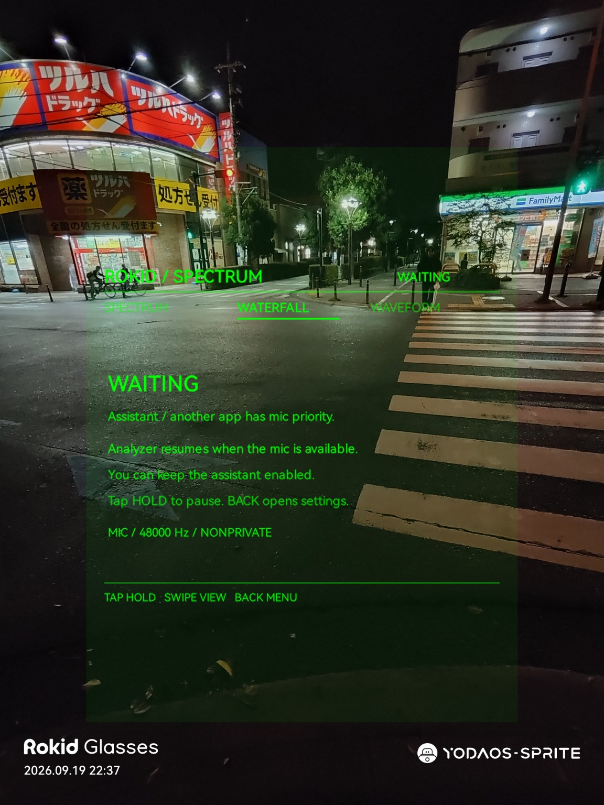
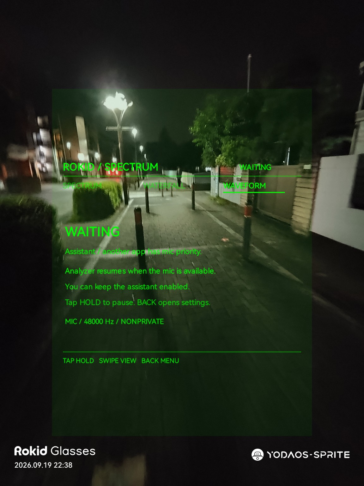

> **非公式・非提携**：本プロジェクトは個人による非公式の開発です。Rokid社およびその関連会社とは提携しておらず、承認・支援・スポンサー提供を受けていません。
> **Unofficial and unaffiliated**: This is an independent, unofficial project. It is not affiliated with, endorsed, supported, or sponsored by Rokid or its affiliates.

# 実機写真 / Device screenshots

ユーザー提供のRokid Glasses画面写真です。画像は提供されたまま掲載し、写っている版と症状を以下に明記しています。実音解析の成功を示す写真はありません。

User-provided Rokid Glasses screen photos, published unchanged. Version and observed issue are identified below. None demonstrates successful live microphone analysis.

## v1.0.0-mic-busy.jpg

## v1.0.2-waiting-waterfall.jpg

## v1.0.2-waiting-spectrum.jpg

## v1.0.2-waiting-waveform.jpg

